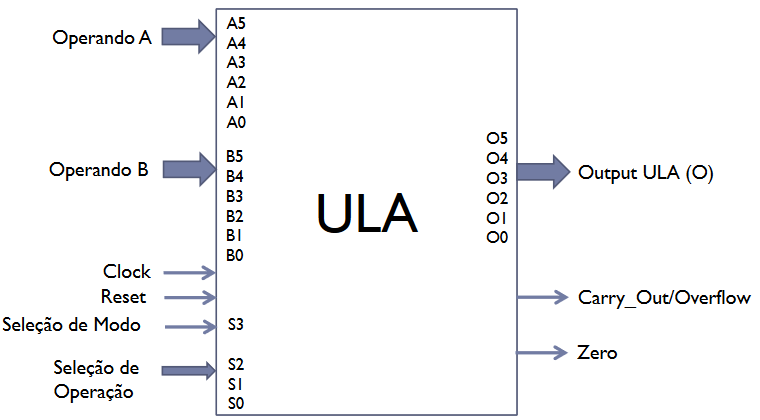
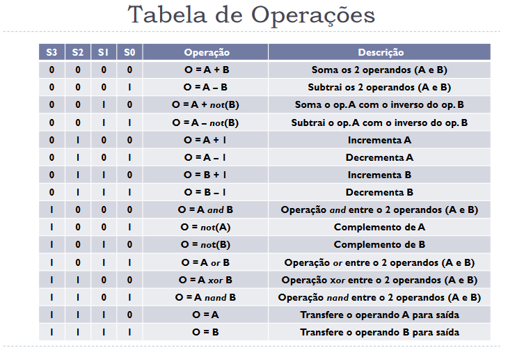

# ULA

O projeto teve como proposito de desenvolver uma [ULA](https://pt.wikipedia.org/wiki/Unidade_l%C3%B3gica_e_aritm%C3%A9tica) que faz 8 tipos de operações aritméticas e 8 tipos de operações lógicas.

A representação da ULA e os seus comandos podem ser visualizado nas imagens abaixo.

